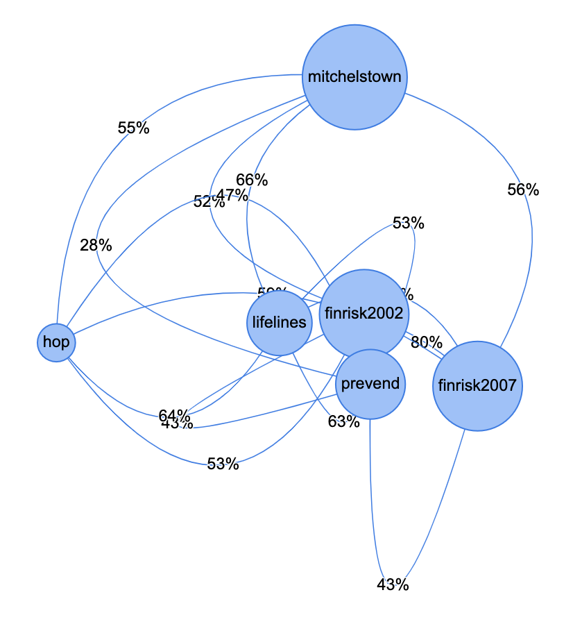
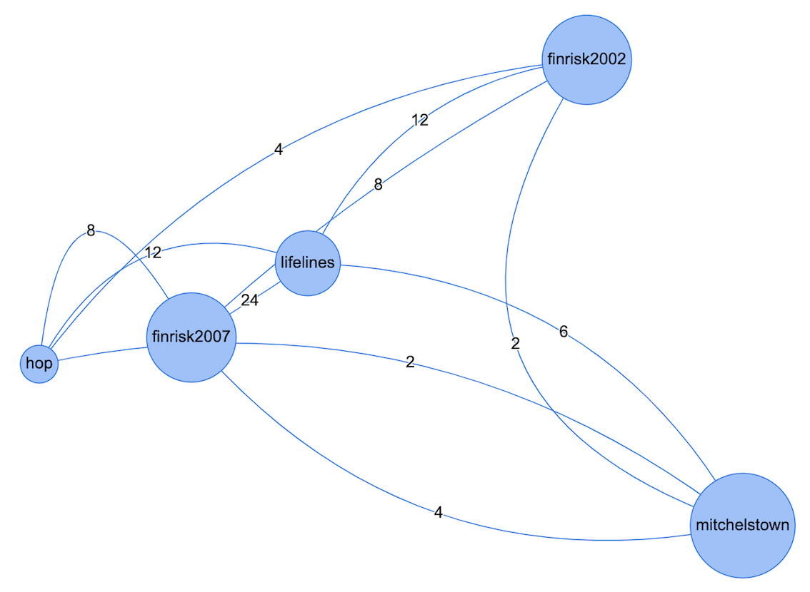
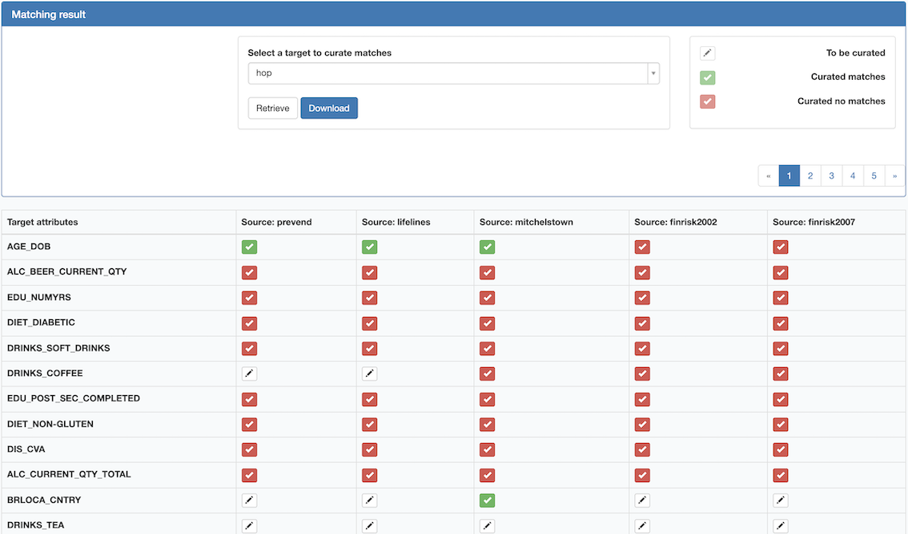
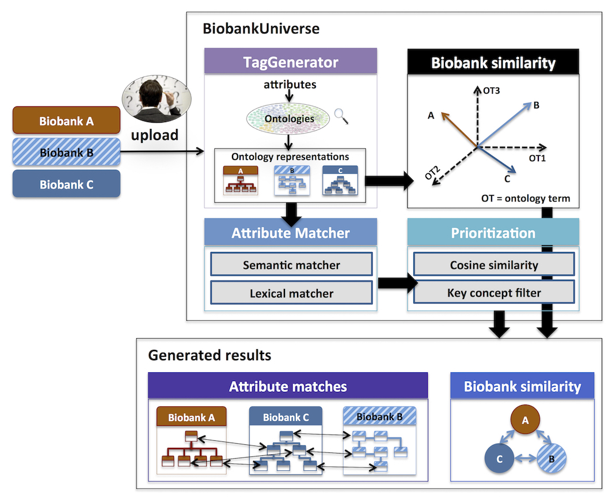

# **Project is archived** - Welcome to BiobankUniverse

## Introduction
Welcome to BiobankUniverse. The demonstration website has been archived on the 13th of September 2021. Below for your convenience an overview of what you would have found. The features of BiobankUniverse have been merged with the MOLGENIS 'mapping service'.

BiobankUniverse was a data discovery and matching system for biobanks built in ([MOLGENIS](https://github.com/molgenis/molgenis)) that could automatically tag biobank attributes (metadata) with ontology terms from Unified Medical Language System (UMLS) and based on which generate candidate attribute matches between biobanks. In addition, BiobankUniverse could calculate the overall similarities between biobanks so that users can quickly get an approximation of how close/far the biobanks are to each other. Please note that this server is shelved, for the greatest and latest features of MOLGENIS look ([here](https://www.molgenis.org)).

The instruction on how to deploy it in tomcat 7 can be found ([here](http://www.molgenis.org/wiki/Molgenis-connect)). The source code is avaiable on ([GitHub](https://github.com/chaopang/molgenis/tree/feature/biobankuniverse)). 

---

## Discover biobanks

The circle represents a biobank and the larger a biobank, the larger the circle. The line represents the distance between the biobanks, the longer the line, the less similar the connected biobanks are to each other. There are two types of universes, one is generated based on the overall similarity of the automatically tagged ontology terms, the other one is generated based on the number of candidate matches.

For example, see image below. When clicked on the button 'Number of matches', typed in 'Beer' in the search box and selected 'C0004922:Beer' and then hit the 'Search' button, only the candidate matches related to 'Beer' are retrieved and universe will reduce in size. The search box was configured with typeahead function to provide ontology terms. See the image 'Example 2' below.

---

## Curate attribute matches

We had pre-generated the candidate attribute matches between the biobanks including Finrisk2002, Finrisk2007, Lifelines, Prevend, Mitchelstown and HOP. The matches generated where pairwise so users needed to choose a leading 'target' data schema to generate the match table, in which they can curate the candidate matches. An example can be seen in 'Example 3' with the term 'hop'.

---

## Technical design

---

# If you want to use molgenis with new features, visit [molgenis.org](https://molgenis.org)
