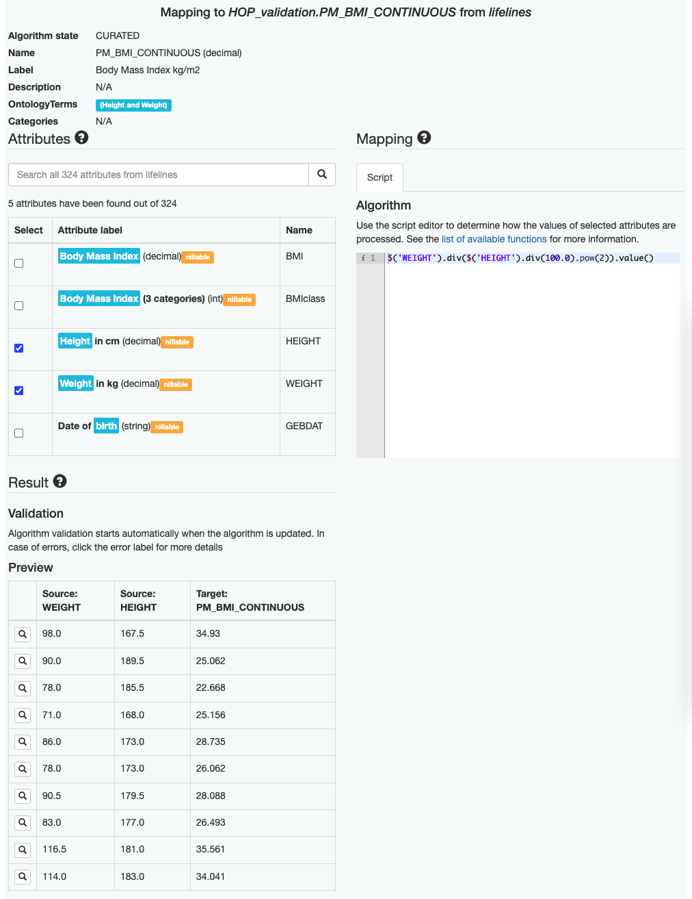
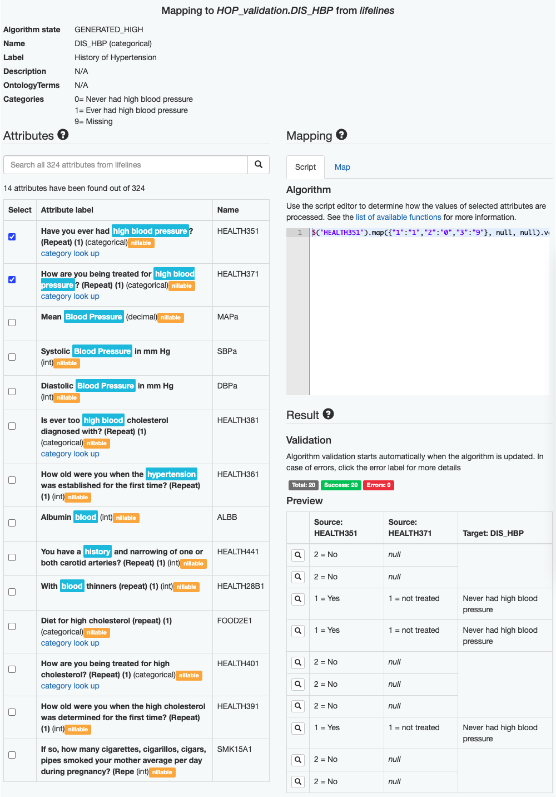
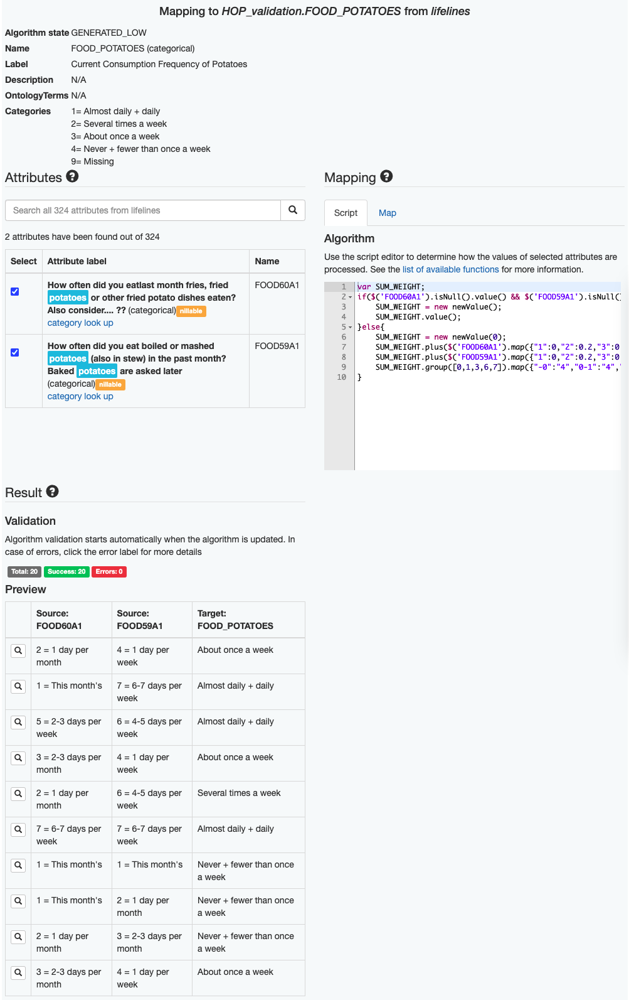

# **Project is archived** - Welcome to MOLGENIS/connect


## Background

MOLGENIS/connect was a semi-automatic data integration system built in ([MOLGENIS](https://github.com/molgenis/molgenis)) that can assist researchers in finding, matching and pooling data from different biobanks. During the data integration process, Molgenis/connect not only can suggest relevant data elements from biobanks for the given interest of research variables but also is capable of generating data tranformation algorithms for data integration. In addition, users can easily interact with the system to improve upon the suggested mappings and algorithms. 

The instruction on how to deploy it in tomcat 7 can be found ([here](http://www.molgenis.org/wiki/Molgenis-connect)). The source code is avaiable on ([GitHub](https://github.com/molgenis/molgenis/tree/1.15)).

---

## Demo

The demo is no longer available because the project is archived. There is however still a live demo on ([YouTube](https://www.youtube.com/watch?v=Gc1VKRCmTWU)). 

The demo was created using data from the BioSHARE project. The target schema consists of approximiately 90 core data elements e.g. Body Mass Index, History of Hypertension representing the research question. Three biobanks (LifeLines, Prevend and Mitchelstown) are selected in this demo as the source datasets for which we have the data. The task is to harmonize the 90 core data elements in the three biobanks separately and then pool the harmonized results into one dataset.


## Demo data

Although the demo version did not have full functionality, it allowed you to view all the mappings and algorithms in the demo mapping project that have been generated in advance. You are not able anymore to try out the semantic search and the algorithm generator functions in the demo. The examples are no longer available.


The first image is of 'Example 2'. Here you can see an example of the mapping + algorithm auto-generated for the target data element Body Mass Index kg/m2 (BMI) in the biobank lifelines.



### The explanation of generating the algorithm for BMI in lifelines

> The semantic search is applied to find all the relevant data elements in lifelines for BMI.
> 1. BMI: Body Mass Index
> 2. HEIGHT: Height in cm
> 3. WEIGHT: Weight in kg
> 4. .....
> 
> The algorithm generator checks if there are any pre-defined templates associated with BMI and the template is detecetd in the database shown below.
>
> ``` 
> $('weight').div($('height').pow(2)).value() 
> ````
> 
> The algorithm generator implements the BMI template with the data elements found in lifelines. Units of mapped data elements are adjusted accordingly e.g. HEIGHT is divided by 100.
> 
> ```
> $('WEIGHT').div($('HEIGHT').div(100.0).pow(2)).value()
> ```

---

In 'Example 3' image you can see the mapping + algorithm auto-generated for the target data element History of Hypertension in the biobank lifelines. In the example, you will find that: 

> * the first suggested data element is 'Do you ever have high blood pressure' because 'high blood pressure' is a synonym of 'Hypertension'. 
> * the target categories and source categories are automatically matched based on the lexical similarity.



---

In the image of 'Example 4' you can see the mapping + algorithm auto-generated for the target data element Current Consumption Frequency of Potatoes in the biobank lifelines. In the example, target and source categories are automatically matched following a strategry, where

> * both of the target and source categories are first converted to quantifiable amounts. 
> .. The source amounts are matched to the closest target amounts.

You will see that only the first source data element is used in the algorithm. However the second element is also related to Potatoes, therefore

> * you need to select the checkbox of the second data element.
> * you will see that the algorithm is updated based on the new selection of data elements. 



---

## Technical design
First, we developed the semantic search that uses ontology-based query expansion to find relevant data elements from biobanks, irrespective of variations in the terminologies used. Second, we created the algorithm generator that can automatically generate data transformation algorithms to convert these data elements to the target schema, including unit conversion, category mapping, and more complex recurring conversion patterns e.g. calculation of BMI.

---

# If you want to use molgenis with new features, visit [molgenis.org](https://molgenis.org)